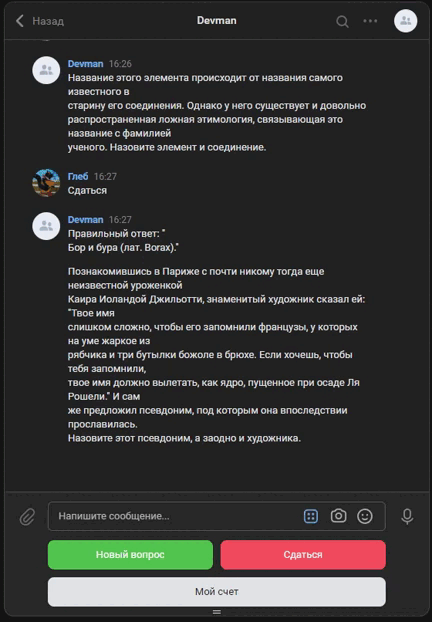

# Quiz

This project includes two chatbots and a script for adding quiz questions:
- quiz_telegram_bot.py allows interactive with the user in the Telegram application
- quiz_vk_bot.py allows interactive with the user in the VK application
- add_quiz_questions.py automates the addition of new quiz

The programs are created for entertainment purposes, allowing the user to learn a lot of new things in a game format, while also testing their knowledge in a wide range of areas.

## Enviroments

To work with the quiz_telegram_bot.py application:
- create two bots (you can obtain bot from @BotFather in Telegram) and get tokens from them, one bot for the chatbot, the second for error monitoring
  (you can obtain bot from @BotFather in Telegram, [See example](https://telegra.ph/Awesome-Telegram-Bot-11-11))
- create the file .env and fill in this data:
  - TELEGRAM_API_TOKEN
  - TELEGRAM_MONITOR_API_TOKEN
  - TELEGRAM_CHAT_ID a unique identifier of the telegram administrator of the chatbot, to whom possible errors will be directed
    
To work with the quiz_vk_bot.py application:
- create bot (you can obtain bot from @BotFather in Telegram) and get token from it
- create an open vk group and get a token from it
- create the file .env and fill in this data:
  - VK_API_TOKEN - token from the vk group
  - TELEGRAM_MONITOR_API_TOKEN
  - TELEGRAM_CHAT_ID a unique identifier of the telegram administrator of the vk chatbot, to whom possible errors will be directed
  
Optionally:
  - QUIZ_FILE_PATH is the path to the quiz file. By default, it is located in the root of the project at "files/quiz.txt"
## Installing

To get started go to terminal(mac os) or CMD (Windows)
- create virtualenv, [See example](https://python-scripts.com/virtualenv)

- clone github repository or download the code

```bash
$git clone https://github.com/Rostwik/Quiz.git
```

- install packages

```bash
$pip install -r requirements.txt
```
- run the program 
```bash
$python quiz_telegram_bot.py
```

## Examples

You can see working chatbots here:

- [tg_bot](https://t.me/Space_photography_bot)
- [vk_bot](https://vk.com/club219848348)



## License

This project is licensed under the MIT License - see the [LICENSE.md](LICENSE.md) file for details


